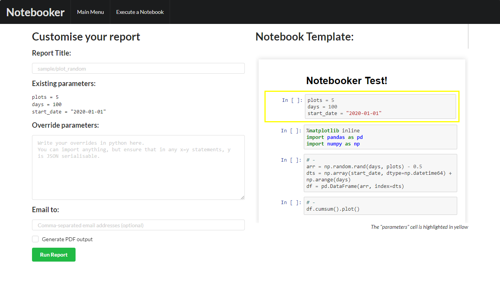
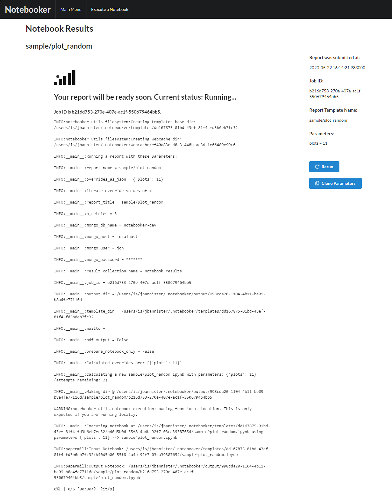
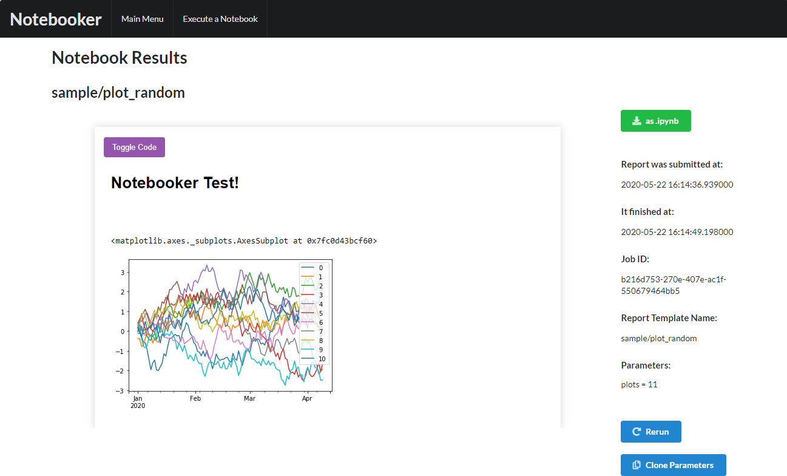
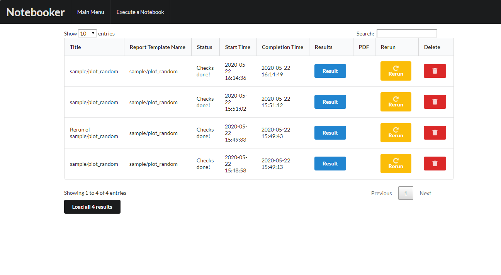

Productionise your Jupyter Notebooks, just as interactively as you wrote them. Notebooker is a webapp which can execute and parametrise Jupyter Notebooks as soon as they have been committed to git. The results are stored in MongoDB and searchable via the web interface, essentially turning your Jupyter Notebook into a production-style web-based report in a few clicks.

## Run a jupyter notebook as a report with parameters

## Execute Jupyter notebooks either on the webservice or command line

## View the output of notebooks as static HTML

## All reports accessible on the home screen, regardless of how they were executed

## Getting started
See the documentation at [https://notebooker.readthedocs.io/](https://notebooker.readthedocs.io/) for installation instructions.

Notebooker has been tested on Linux, Windows 10, and OSX; the webapp has been tested on Google Chrome.

# Contributors
Notebooker has been actively maintained at Man Group since late 2018, with the original concept built by 
[Jon Bannister](https://github.com/jonbannister). 
It would not have been possible without contributions from:

* [Douglas Bruce](https://github.com/douglasbruce88)
* [Franek Jemiolo](https://github.com/FranekJemiolo)
* [Sam Ratcliff](https://github.com/sparks1372)
* [Matthew Dodds](https://github.com/doddsiedodds)
* [Dominik Christ](https://github.com/DominikMChrist)

And these fantastic projects:

* [Jupytext](<https://github.com/mwouts/jupytext>)
* [papermill](<https://github.com/nteract/papermill>)
* [nbconvert](<https://github.com/jupyter/nbconvert>)
* [Fomantic-UI](<https://github.com/fomantic/Fomantic-UI>)

